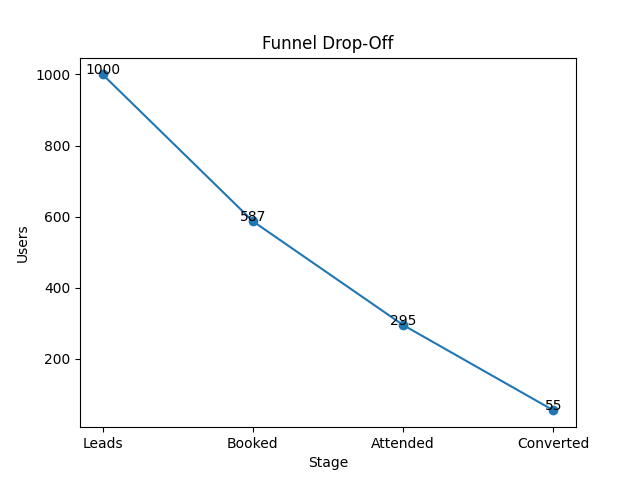

# Founder OS Revenue Engine

A founder-facing revenue operating system for diagnosing funnel leakage, prioritizing weekly GTM actions, and turning scattered pipeline signals into an operating cadence.

Early-stage founders lose revenue when pipeline movement, funnel leakage, conversion risk, and weekly action ownership are spread across CRM exports, team notes, and ad hoc updates. This repo models a lightweight Founder OS workflow that shows where revenue is leaking, what to fix first, and how to communicate the operating focus clearly.

## Problem

Founders do not usually need another dashboard. They need a fast way to answer:

- Where is revenue leaking in the funnel?
- Which bottleneck matters most this week?
- What action should the team own next?
- How should the revenue story be communicated to operators, sales, and investors?

This project turns a simulated early-stage funnel into a repeatable review process for revenue diagnosis, prioritization, and weekly execution.

## How It Helps

- Converts messy funnel movement into a decision-ready view of leakage, leverage, and priority actions.
- Demonstrates how a founder's office operator moves from analysis to execution notes, not just charts.
- Provides a lightweight structure for weekly revenue diagnosis, action prioritization, and investor-style communication.
- Supports a recurring GTM/revenue review cadence without requiring a full BI implementation.

## Call-level input

Founder OS Revenue Engine diagnoses funnel leakage at the weekly revenue level. [Founder-Led Sales Call OS](https://github.com/shubham1502-hue/founder-led-sales-call-os) works one layer deeper by extracting call-level objections, confusion, urgency, and deal rescue actions that explain why the funnel is leaking.

## Automation leverage input

Founder OS Revenue Engine diagnoses revenue leakage. [Founder AI Workflow ROI OS](https://github.com/shubham1502-hue/founder-ai-workflow-roi-os) helps decide which revenue, RevOps, reporting, or handoff workflows are worth automating, hiring for, outsourcing, or leaving manual.

## What This Repo Includes

- `data/generate_data.py`: creates a synthetic lead-to-revenue dataset.
- `data/raw_data.csv`: sample generated funnel data used by the scripts.
- `context/startup_overview.md`: company context placeholder for adapting the system.
- `analysis/revenue_leak.py`: calculates funnel rates, revenue leakage, and the largest drop-off stage.
- `analysis/funnel_chart.py`: charting script for funnel visualization.
- `assets/funnel_chart.png`: existing funnel snapshot used by the README.
- `execution/task_prioritization.py`: ranks founder actions using impact, urgency, and effort.
- `communication/investor_update.py`: prints an investor-style operating update from the funnel metrics.
- `case/founder_case.md`: written case simulation with findings, hypotheses, and execution plan.
- `founder_note.md`: short note on the Founder OS operating philosophy.

## When To Fork This

- Fork this if your startup has leads, demos, attendance, conversion, or revenue stages but no clear weekly operating cadence.
- Fork it when growth debates are based on opinions instead of quantified funnel bottlenecks.
- Replace the simulated data with your CRM funnel export, then tune the priority scoring and update templates.

## System Workflow

1. Generate or refresh the funnel dataset.
2. Measure booking, attendance, conversion, and revenue throughput.
3. Identify the biggest funnel leak and the highest-leverage operating fix.
4. Convert the diagnosis into a ranked weekly action list.
5. Produce a concise founder/investor update for the GTM review cadence.

The system is intentionally small: it is a practical operating loop, not a heavyweight BI stack.

## KPI / Funnel Logic

The repo models a simple lead-to-revenue funnel:

```text
Lead -> Demo Booked -> Demo Attended -> Converted -> Revenue
```

Core metrics:

- Demo booking rate = booked demos / total leads
- Demo attendance rate = attended demos / booked demos
- Conversion rate = converted customers / attended demos
- Revenue leakage = modeled expected revenue - actual generated revenue
- Priority score = impact x urgency / effort

The current sample data shows roughly:

- Demo booking rate: 58%
- Demo attendance rate: 50%
- Conversion rate: 18%

In the sample case, conversion is the largest drop-off, while improving demo attendance is framed as the highest-leverage weekly operating fix because it increases throughput before the conversion stage.

## Funnel Snapshot



## Example Founder Use Cases

- Weekly revenue review: identify the main funnel constraint before the GTM meeting.
- Founder office cadence: turn funnel metrics into a short action plan with owners.
- Sales ops diagnosis: separate attendance problems from post-demo conversion problems.
- Investor update prep: translate funnel performance into a clear operating narrative.
- RevOps onboarding: replace the sample data with a CRM export and adapt the scoring rules.

## Use This In Your Company

This repo is designed to be forked into an internal company workflow. Replace the sample inputs with your company context, keep only the pieces that match your operating cadence, and use the MIT license as the reuse baseline.

1. Replace the sample dataset with a weekly CRM or spreadsheet export.
2. Map your funnel stages to the fields used by the scripts.
3. Run the analysis before the weekly GTM or founder staff meeting.
4. Assign one owner and one due date to the highest-priority action.
5. Re-run the system weekly and track whether the bottleneck moves.
6. Use the investor update script as a starting point for internal and external reporting.

## Minimum Edits Before First Use

| Edit | Where | Why |
| --- | --- | --- |
| Replace sample data | `data/raw_data.csv` or `data/generate_data.py` | Use your actual funnel stages, sources, reps, and revenue fields. |
| Rewrite company context | `context/startup_overview.md` | Make the workflow reflect your GTM motion, customer, pricing, and stage. |
| Update funnel definitions | `analysis/revenue_leak.py` | Match your company motion, such as signup, activation, meeting, trial, or paid conversion. |
| Tune priority scoring | `execution/task_prioritization.py` | Reflect your real operating constraints, team capacity, and urgency. |
| Adapt update language | `founder_note.md` and `communication/investor_update.py` | Match the tone and metrics used in your board, investor, or leadership updates. |
| Add owners and dates | `case/founder_case.md` | Turn recommendations into a weekly operating plan. |

You can leave the funnel chart, analysis structure, and case-study layout alone on the first fork. Replace the data first; tune scoring only after the first real readout feels off.

## How To Run / Use

Run commands from the repo root:

```bash
python3 data/generate_data.py
python3 analysis/revenue_leak.py
python3 execution/task_prioritization.py
python3 communication/investor_update.py
```

Dependencies used by the scripts:

- `pandas`
- `numpy`
- `matplotlib` for the charting script

The core workflow is terminal-based. The chart image in `assets/funnel_chart.png` is included as a visual snapshot; adapt the chart script path if you regenerate charts in your own environment.

## Outputs

- Funnel metrics: total leads, booking rate, attendance rate, conversion rate.
- Revenue view: generated revenue, expected revenue, and estimated leakage.
- Bottleneck diagnosis: biggest drop-off stage and recommended fix.
- Priority list: founder actions ranked by impact, urgency, and effort.
- Investor-style update: concise metrics, current problem, actions this week, and focus area.

## Folder Structure

```text
.
|-- analysis/
|   |-- funnel_chart.py
|   `-- revenue_leak.py
|-- assets/
|   `-- funnel_chart.png
|-- case/
|   `-- founder_case.md
|-- communication/
|   `-- investor_update.py
|-- context/
|   `-- startup_overview.md
|-- data/
|   |-- generate_data.py
|   `-- raw_data.csv
|-- execution/
|   `-- task_prioritization.py
|-- .gitignore
|-- LICENSE
|-- founder_note.md
`-- README.md
```

## Customization Guide

- For PLG SaaS: rename funnel stages to signup, activation, retained, paid.
- For sales-led SaaS: map stages to lead, qualified, meeting, proposal, closed-won.
- For services or agencies: map stages to inquiry, discovery, proposal, signed, billed.
- For marketplace or fintech workflows: add risk, approval, or transaction completion stages.
- For team cadence: add owner, due date, status, and next review date to the priority output.

Keep the operating loop stable even as the metrics change: diagnose the leak, choose the highest-leverage fix, assign ownership, and review progress weekly.

## Portfolio Note

This repo is part of a Founder OS / RevOps portfolio: practical systems for early-stage founders who need clearer operating visibility, faster revenue diagnosis, and sharper weekly execution. It is designed to show how a founder's office operator can move from messy funnel data to decisions, actions, and narrative clarity.
